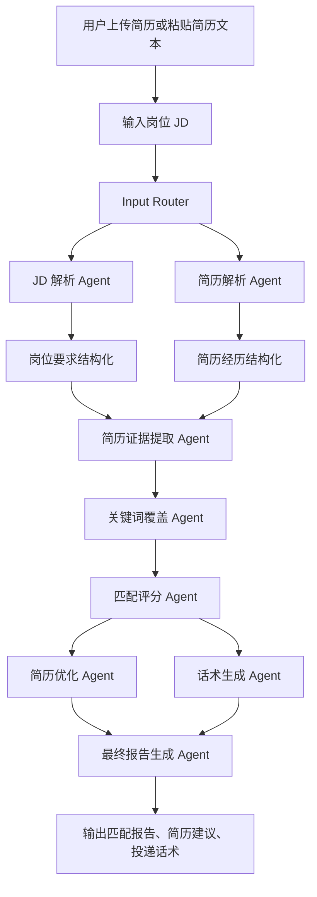
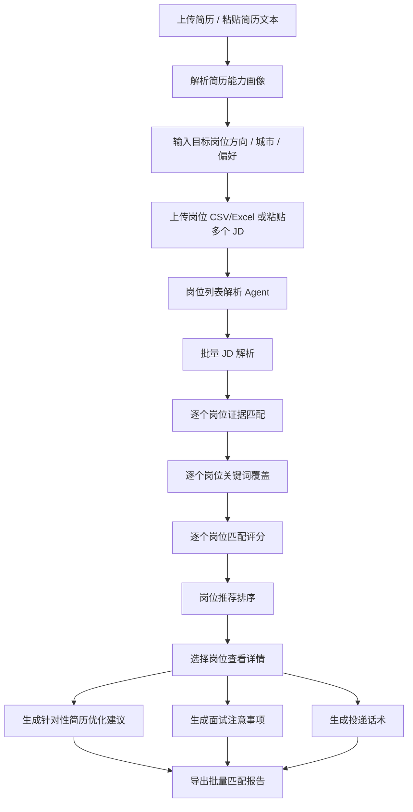
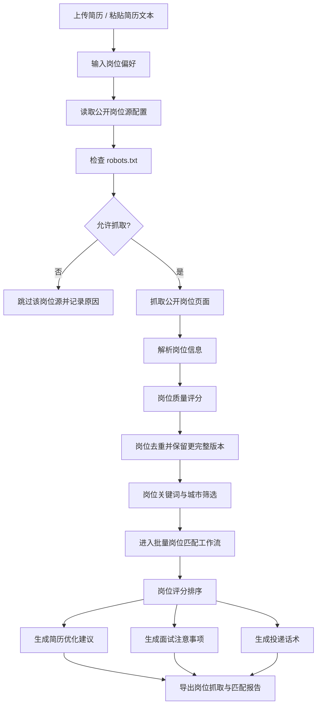
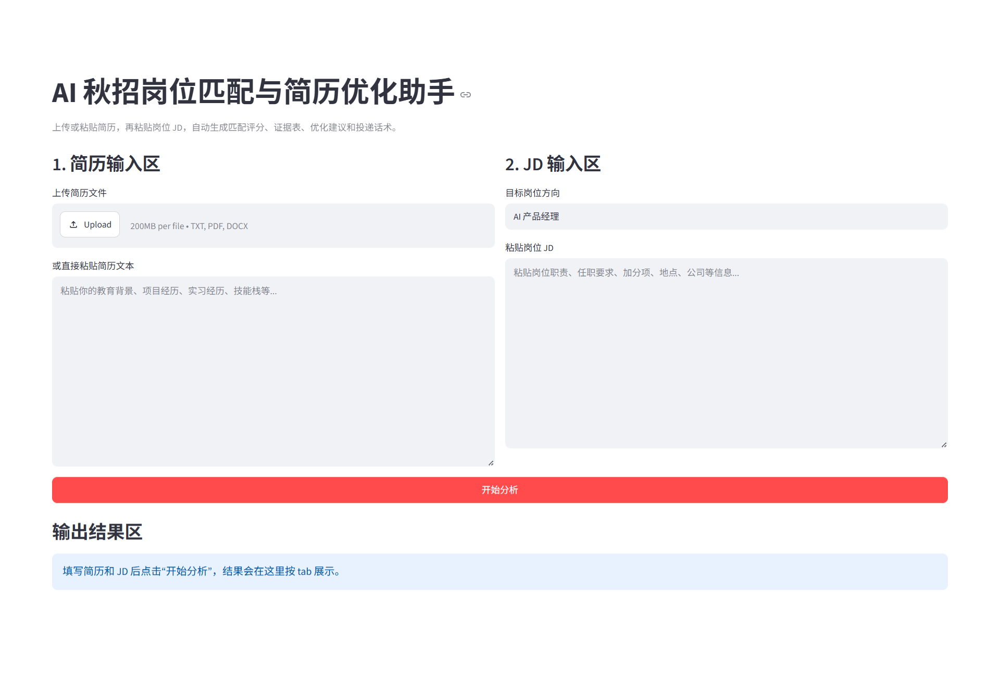
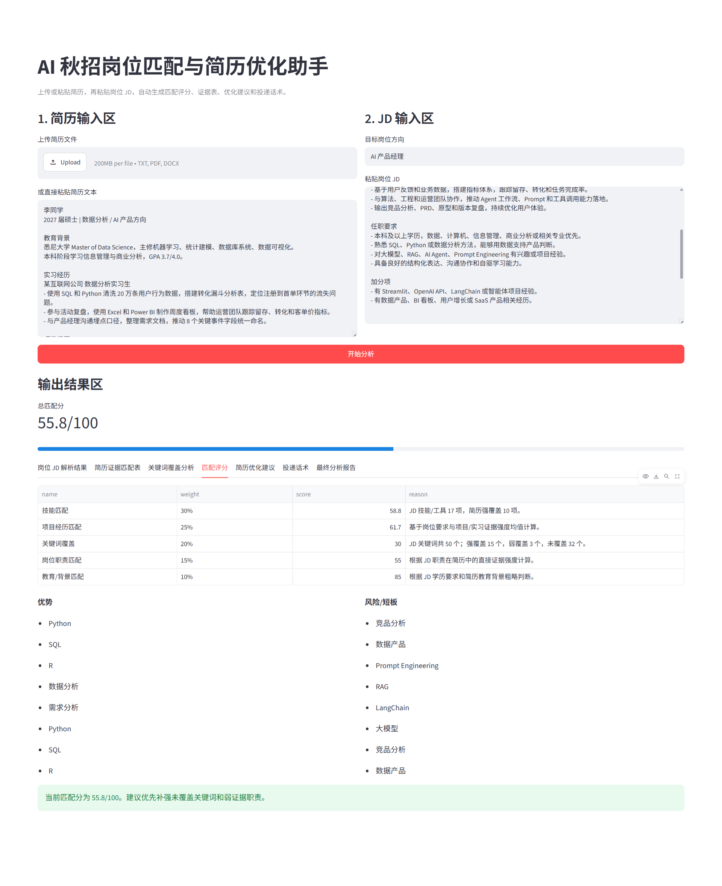
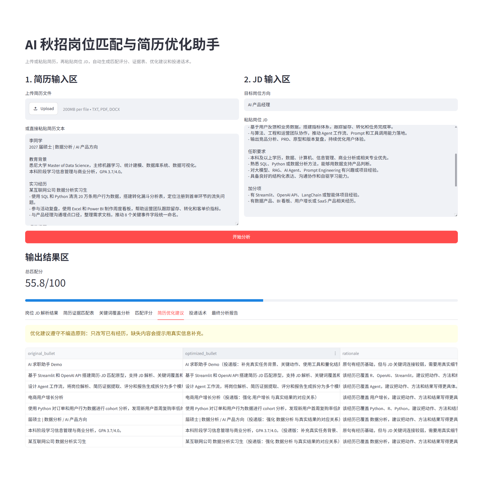

# AI 岗位搜索、匹配评分与求职优化助手

**AI Job Matching, Resume Optimization and Career Application Assistant**

[](https://github.com/Lxm9939/ai-job-match-resume-agent/actions/workflows/test.yml)
[](LICENSE)

一个基于 Streamlit 与多 Agent 工作流的求职辅助工具，支持用户上传简历、输入或抓取岗位信息，并自动完成岗位解析、简历证据匹配、关键词覆盖、匹配评分、简历优化、面试准备和求职数据分析 Dashboard。

本项目适用于实习、校招、秋招、社招、转行、海外留学生回国求职和在职跳槽等多种求职场景。

项目同时提供 **V1 单 JD 深度分析**、**V2 批量岗位匹配推荐** 和 **V3 公开岗位源抓取**，并通过 V3.2 Dashboard 汇总岗位城市、类型、推荐结论、质量分布和高频技能。它不是简单的“LLM 简历改写器”，而是一个结合 AI Agent 编排、规则评测和数据分析的可运行项目。没有 API Key 或真实岗位源时，也能使用本地 Demo 完整演示。

## 项目背景

不同求职阶段的候选人在岗位申请中经常会遇到几个高频问题：

- JD 信息复杂，岗位职责、硬技能、业务关键词和隐含能力混在一起，难以快速拆解。
- 简历与岗位之间的匹配证据不清晰，很多经历明明相关，但没有写成招聘方能识别的表达。
- 关键词覆盖不足，简历容易在初筛和 ATS 环节失分。
- 批量投递时，每个岗位都手动改简历和写话术，效率低且容易遗漏重点。

本项目把这些环节拆成可解释的 Agent 工作流，用一个可运行的网页 MVP 帮助候选人快速完成“JD 理解 - 简历匹配 - 优化建议 - 投递表达”的闭环。

## 目标用户

- 应届生和实习求职者。
- 海外留学生及回国求职用户。
- 社招候选人与在职跳槽用户。
- 转向数据、AI、产品和分析岗位的求职者。
- 申请 AI 应用、Data Agent、数据分析、商业分析、BI 分析和产品经理等岗位的人。
- 需要批量比较岗位、优化简历并准备面试的求职者。

## V1 / V2 / V3 功能

### V1：单个 JD 匹配分析

- JD 解析：提取岗位名称、公司、地点、职责、硬技能、软技能、工具栈、业务关键词、学历要求、经验要求和隐含能力。
- 简历解析：提取教育背景、项目经历、实习经历、技能栈、成果指标、关键词和可迁移能力。
- 简历证据提取：把岗位要求映射到简历项目、实习和技能证据，输出证据强度和补充表达。
- 关键词覆盖分析：比较 JD 关键词和简历关键词，输出已覆盖、弱覆盖和未覆盖关键词。
- 可解释匹配评分：按技能 30%、项目经历 25%、关键词覆盖 20%、岗位职责 15%、教育/背景 10% 计算 0-100 分。
- 简历优化建议：基于原简历 bullet 做改写建议，遵守“不编造经历、不虚构项目、不添加用户没做过的内容”。
- 多渠道投递话术生成：生成 Boss 直聘打招呼、邮件正文、LinkedIn 私信、内推请求和面试自我介绍初稿。
- Markdown / Word 报告导出：支持下载 `.md` 和 `.docx` 分析报告。

### V2：批量岗位匹配推荐

- 支持上传 CSV / Excel 岗位列表，或使用 `---JOB---` 分隔粘贴多个 JD。
- 支持填写目标岗位方向、城市、岗位类型和公司偏好。
- 复用 V1 Agent 对每个岗位执行证据匹配、关键词覆盖和五维评分。
- 按匹配总分降序生成岗位排行榜和分档投递建议。
- 为每个岗位生成针对性简历优化、投递话术和面试准备清单。
- 支持下载批量 Markdown 匹配报告。
- 不抓取需要登录或受反爬限制的招聘平台，当前由用户主动导入岗位数据。

### V3：公开岗位源自动抓取

- 从用户配置的公开公司 Careers 静态 HTML 页面读取岗位候选。
- 请求前检查 robots.txt，网络检查失败时默认跳过。
- 设置明确 User-Agent、请求超时、至少 1 秒来源间隔、最大岗位数和一小时本地缓存。
- 按岗位方向、关键词、城市和岗位类型筛选，再复用 V2 完成评分排序。
- 保留每条岗位的来源链接，并支持下载抓取岗位 CSV 和匹配 Markdown 报告。
- 内置 `examples/sample_crawled_jobs.json`，无需真实网站即可演示完整 V3。
- 不支持登录、验证码、Cookie、代理池、模拟登录或任何反爬绕过。

### V3.1：抓取可靠性增强

- 岗位去重：优先按 `source_url`，缺失链接时按公司、岗位名称和城市识别重复记录。
- 版本选择：重复岗位保留字段更完整、JD 更长的版本，并记录重复组。
- 岗位质量评分：按标题、公司、城市、JD 长度、技能关键词、来源链接和发布日期计算 0-100 分。
- 质量标签：输出高/中/低三档；低质量岗位保留分析，但明确标记为“低置信度”。
- 抓取统计：展示原始、去重后、筛选后数量，质量分布，以及 robots 跳过和抓取失败来源数量。

### V3.2：岗位匹配数据分析 Dashboard

- 总览指标：岗位总数、平均/最高/最低匹配分、三档投递建议、质量分布和低置信度数量。
- 分布分析：城市分布、岗位类型分布、推荐结论分布和岗位质量分布。
- Top 分析：高匹配岗位 Top 10、缺失关键词 Top 10、常见技能关键词 Top 10 和风险关键词 Top 10。
- 导出增强：岗位匹配排行榜 CSV、缺失关键词 CSV、岗位分析 Summary Markdown。
- V2 与 V3 共用同一分析口径，便于比较手动导入岗位和公开来源岗位。

## Agent 工作流图

查看 Agent 输出样例：[docs/agent_outputs.md](docs/agent_outputs.md)

### V1 单 JD 工作流



### V2 批量岗位工作流



### V3 公开岗位源工作流



## 页面截图

### 首页


### 匹配评分


### 简历优化建议


## 项目结构

```text
ai-job-match-resume-agent/
├── .github/workflows/test.yml
├── app.py
├── README.md
├── AGENTS.md
├── LICENSE
├── requirements.txt
├── .env.example
├── .gitignore
├── src/
│   ├── config.py
│   ├── llm_client.py
│   ├── document_parser.py
│   ├── report_exporter.py
│   ├── analytics.py
│   ├── workflow.py
│   ├── batch_workflow.py
│   ├── crawl_workflow.py
│   ├── agents/
│   ├── job_sources/
│   ├── schemas/
│   └── utils/
├── configs/
│   └── job_sources.example.json
├── data/
│   └── cache/
├── docs/
│   ├── deliverables/
│   ├── project_plan.md
│   ├── workflow.md
│   ├── test_cases.md
│   └── screenshots/
├── examples/
│   ├── sample_resume.txt
│   ├── sample_jd.txt
│   ├── sample_jobs.csv
│   └── sample_crawled_jobs.json
└── tests/
    ├── test_workflow.py
    ├── test_job_list_parser.py
    ├── test_batch_workflow.py
    ├── test_robots_checker.py
    ├── test_job_filter_agent.py
    ├── test_crawl_workflow.py
    ├── test_job_deduplicator.py
    ├── test_job_quality.py
    └── test_analytics.py
```

## 快速开始

```bash
git clone https://github.com/Lxm9939/ai-job-match-resume-agent.git
cd ai-job-match-resume-agent
pip install -r requirements.txt
streamlit run app.py
```

启动后打开 Streamlit 提示的本地地址，通常是 `http://localhost:8501`。

## 环境变量说明

复制 `.env.example` 为 `.env`：

```bash
cp .env.example .env
```

`.env.example` 示例：

```bash
OPENAI_API_KEY=
OPENAI_MODEL=gpt-4o-mini
LLM_MODE=mock
APP_DEBUG=false
```

不要把真实 API Key 写进代码或提交到 GitHub。`.gitignore` 已排除 `.env`。

## Mock 模式说明

没有 API Key 也可以本地演示。默认 `LLM_MODE=mock` 时，系统使用本地规则和关键词库完成结构化分析、评分、优化建议和话术生成。

可选模式：

- `mock`：本地规则模式，无需 API Key。
- `auto`：有 `OPENAI_API_KEY` 时使用 OpenAI，否则回退 mock。
- `openai`：优先使用 OpenAI，调用失败时回退 mock 结果。

V3 的“使用示例抓取结果演示”与 LLM Mock 模式彼此独立：前者避免真实网络请求，后者避免 OpenAI API 请求。两项同时启用时，整个流程可离线演示。

## 添加公开岗位源

复制并修改 `configs/job_sources.example.json`，或在 V3 页面上传同结构 JSON：

```json
[
  {
    "source_id": "my_company_careers",
    "source_name": "My Company Careers",
    "source_type": "public_html",
    "base_url": "https://company.example",
    "list_url": "https://company.example/careers",
    "allowed": true,
    "notes": "无需登录、允许公开访问的公司招聘页"
  }
]
```

添加前请确认：

- 页面无需账号、Cookie、验证码或交互式登录。
- `robots.txt` 允许项目 User-Agent 访问对应路径。
- 来源是公司官网 Careers 页面或其他获得许可的公开静态 HTML 页面。
- 不要添加 Boss 直聘、智联招聘、猎聘、前程无忧、拉勾等登录或强反爬平台。

当前通用解析器以公开静态 HTML 为主。站点结构不同可能导致字段不完整，此时系统会保留来源链接，并将过短内容标记为“JD 信息不足”。

## Limitations / 项目局限性

- Mock 模式是本地规则和关键词库驱动，适合演示产品流程，但不等同于真实 LLM 的语义理解能力。
- 匹配评分是可解释的启发式评分，用于定位优势和短板，不应被当作真实招聘结果或录用概率。
- 批量排行当前按五维匹配总分排序，求职偏好作为结果解释信息，不代表招聘平台推荐算法。
- V3 的通用 HTML 解析依赖页面结构，动态渲染或结构特殊的网站可能无法提取完整岗位。
- V3 只访问明确配置且 robots.txt 允许的公开页面；不支持登录平台、验证码或反爬绕过。
- 岗位质量分衡量抓取字段完整度，不代表岗位真实性、招聘有效性或录用概率。
- 简历优化建议遵循“不编造经历”的原则；用户需要自行确认所有项目、工具、指标和结果都真实发生过。
- 上传或粘贴真实简历前，应注意隐私保护；如果使用 OpenAI 模式，请确认自己接受相应 API 的数据处理方式。

## 测试说明

```bash
pytest
```

当前测试覆盖：

- mock 模式端到端 Agent 工作流。
- `.docx` Word 报告导出是否生成有效 Word 文件。
- CSV 岗位列表解析、多 JD 文本拆分和缺失字段兜底。
- 批量岗位结果数量、降序排序、推荐结论和面试准备输出。
- robots.txt 允许、拒绝和网络失败时的安全跳过。
- V3 岗位偏好筛选与 Demo 抓取结果接入批量匹配。
- 岗位去重、质量评分、低置信度 warning 和 V3 质量统计。
- Dashboard 平均分、推荐/城市/质量分布和 Top 缺失关键词统计。

GitHub Actions 会在 `push` 和 `pull_request` 时自动运行 pytest。

## Future Work / 后续迭代

- 在线部署：部署到 Streamlit Community Cloud、Hugging Face Spaces 或其他平台。
- 多版本简历对比：比较不同简历版本在同一 JD 下的匹配差异。
- 岗位关键词库：为 AI 产品、数据分析、商业分析、数据产品等方向维护专属关键词库和评分策略。
- 站点专属适配器：为获得许可的公司官网招聘页提供可维护的字段选择器。
- 公开 RSS/API 适配：在来源明确授权时增加结构化数据适配器。
- 批量 Word 导出：将 V2 排行榜与逐岗位建议导出为 `.docx`。

## License

This project is licensed under the [MIT License](LICENSE).
