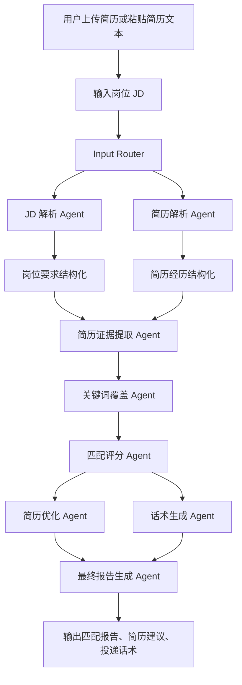

# AI 秋招岗位匹配与简历优化助手

基于 Streamlit 和多 Agent 工作流的求职辅助工具。用户可以上传简历或粘贴简历文本，再粘贴岗位 JD，系统会自动生成岗位匹配分析、简历优化建议、关键词覆盖结果、可解释评分和多渠道投递话术，并支持 Markdown / Word 报告导出。

## 项目背景

秋招投递中，候选人经常会遇到几个高频问题：

- JD 信息复杂，岗位职责、硬技能、业务关键词和隐含能力混在一起，难以快速拆解。
- 简历与岗位之间的匹配证据不清晰，很多经历明明相关，但没有写成招聘方能识别的表达。
- 关键词覆盖不足，简历容易在初筛和 ATS 环节失分。
- 批量投递时，每个岗位都手动改简历和写话术，效率低且容易遗漏重点。

本项目把这些环节拆成可解释的 Agent 工作流，用一个可运行的网页 MVP 帮助候选人快速完成“JD 理解 - 简历匹配 - 优化建议 - 投递表达”的闭环。

## 核心功能

- JD 解析：提取岗位名称、公司、地点、职责、硬技能、软技能、工具栈、业务关键词、学历要求、经验要求和隐含能力。
- 简历解析：提取教育背景、项目经历、实习经历、技能栈、成果指标、关键词和可迁移能力。
- 简历证据提取：把岗位要求映射到简历项目、实习和技能证据，输出证据强度和补充表达。
- 关键词覆盖分析：比较 JD 关键词和简历关键词，输出已覆盖、弱覆盖和未覆盖关键词。
- 可解释匹配评分：按技能 30%、项目经历 25%、关键词覆盖 20%、岗位职责 15%、教育/背景 10% 计算 0-100 分。
- 简历优化建议：基于原简历 bullet 做改写建议，遵守“不编造经历、不虚构项目、不添加用户没做过的内容”。
- 多渠道投递话术生成：生成 Boss 直聘打招呼、邮件正文、LinkedIn 私信、内推请求和面试自我介绍初稿。
- Markdown / Word 报告导出：支持下载 `.md` 和 `.docx` 分析报告。

## Agent 工作流图



## 页面截图

### 首页


### 匹配评分


### 简历优化建议


## 项目结构

```text
ai-job-match-resume-agent/
├── app.py
├── README.md
├── AGENTS.md
├── requirements.txt
├── .env.example
├── .gitignore
├── src/
│   ├── config.py
│   ├── llm_client.py
│   ├── document_parser.py
│   ├── report_exporter.py
│   ├── workflow.py
│   ├── agents/
│   │   ├── jd_parser_agent.py
│   │   ├── resume_parser_agent.py
│   │   ├── evidence_agent.py
│   │   ├── keyword_agent.py
│   │   ├── scoring_agent.py
│   │   ├── resume_optimizer_agent.py
│   │   ├── outreach_agent.py
│   │   └── report_agent.py
│   ├── schemas/
│   │   └── models.py
│   └── utils/
│       └── text_utils.py
├── docs/
│   ├── project_plan.md
│   ├── workflow.md
│   ├── test_cases.md
│   └── screenshots/
├── examples/
│   ├── sample_resume.txt
│   └── sample_jd.txt
└── tests/
    └── test_workflow.py
```

## 快速开始

```bash
git clone <repo-url>
cd ai-job-match-resume-agent
pip install -r requirements.txt
streamlit run app.py
```

启动后打开 Streamlit 提示的本地地址，通常是 `http://localhost:8501`。

## 环境变量说明

复制 `.env.example` 为 `.env`：

```bash
cp .env.example .env
```

`.env.example` 示例：

```bash
OPENAI_API_KEY=
OPENAI_MODEL=gpt-4o-mini
LLM_MODE=mock
APP_DEBUG=false
```

不要把真实 API Key 写进代码或提交到 GitHub。`.gitignore` 已排除 `.env`。

## Mock 模式说明

没有 API Key 也可以本地演示。默认 `LLM_MODE=mock` 时，系统使用本地规则和关键词库完成结构化分析、评分、优化建议和话术生成。

可选模式：

- `mock`：本地规则模式，无需 API Key。
- `auto`：有 `OPENAI_API_KEY` 时使用 OpenAI，否则回退 mock。
- `openai`：优先使用 OpenAI，调用失败时回退 mock 结果。

## 测试说明

```bash
pytest
```

当前测试覆盖：

- mock 模式端到端 Agent 工作流。
- `.docx` Word 报告导出是否生成有效 Word 文件。

## 后续迭代计划

- 批量 JD 匹配排序。
- 岗位关键词库和行业/方向专属评分策略。
- 多版本简历对比与优化记录。
- 更严格 JSON Schema 校验、LLM 重试与输出修复。
- UI 自动化测试和截图回归测试。
- 在线部署到 Streamlit Community Cloud、Hugging Face Spaces 或其他平台。
