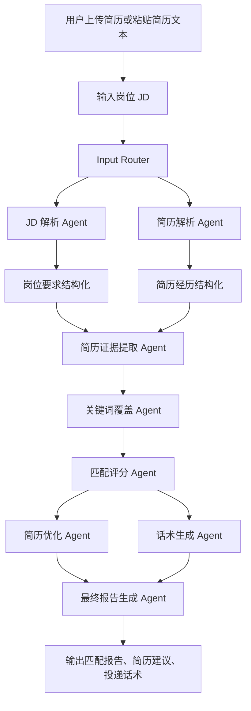

# Agent 工作流

本项目采用模块化 Agent 工作流。每个 Agent 负责一个清晰步骤，输入输出使用 Pydantic 模型承接。MVP 默认使用 mock/规则模式；当 `.env` 中配置 `OPENAI_API_KEY` 且 `LLM_MODE=openai` 或 `auto` 时，Agent 会通过 `src/llm_client.py` 调用 OpenAI API 做增强解析，并在失败时回退到本地规则结果。

## 工作流总览

| 步骤 | 模块 | 输入 | 处理逻辑 | 输出 |
| --- | --- | --- | --- | --- |
| 1 | Input Router | 上传文件、粘贴简历、JD、目标岗位方向 | 解析文件并合并文本，校验简历和 JD 非空 | 简历文本、JD 文本、岗位方向 |
| 2 | JD 解析 Agent | JD 文本、岗位方向 | 提取岗位名称、公司、地点、职责、硬技能、软技能、工具、业务关键词、学历经验和隐含能力 | `JDAnalysis` |
| 3 | 简历解析 Agent | 简历文本 | 提取教育、项目、实习、技能、成果指标、关键词和可迁移能力 | `ResumeAnalysis` |
| 4 | 简历证据提取 Agent | `JDAnalysis`、`ResumeAnalysis` | 将 JD 要求与简历项目/实习/技能映射，判断强/中/弱/缺失 | `List[EvidenceMatch]` |
| 5 | 关键词覆盖 Agent | `JDAnalysis`、`ResumeAnalysis` | 比较 JD 关键词与简历关键词，识别强覆盖、弱覆盖、未覆盖 | `KeywordCoverage` |
| 6 | 匹配评分 Agent | JD、简历、证据、关键词覆盖 | 按技能 30%、项目 25%、关键词 20%、职责 15%、教育 10% 计算分数 | `ScoreBreakdown` |
| 7 | 简历优化 Agent | JD、简历 | 对原始 bullet 做投递版改写建议，保持不编造原则 | `List[OptimizationSuggestion]` |
| 8 | 话术生成 Agent | JD、简历、评分、岗位方向 | 生成 Boss、邮件、LinkedIn、内推和面试介绍话术 | `OutreachMessages` |
| 9 | 最终报告 Agent | 全部中间结果 | 汇总为结构化 Markdown 报告 | `FinalReport` |
| 10 | 报告导出模块 | `WorkflowResult` | 将结构化结果写入 Word 文档 | `.docx` bytes |

## Agent 详细说明

### JD 解析 Agent

- 文件：`src/agents/jd_parser_agent.py`
- 输入：岗位 JD 文本、目标岗位方向。
- 处理逻辑：识别职责段落、技能关键词、工具栈、业务关键词、学历和经验要求；根据岗位方向推断隐含能力。
- 输出：岗位名称、公司、地点、职责、硬技能、软技能、工具栈、业务关键词、学历要求、经验要求、隐含能力。

### 简历解析 Agent

- 文件：`src/agents/resume_parser_agent.py`
- 输入：简历纯文本。
- 处理逻辑：按教育、项目、实习、技能等标题拆分；抽取量化指标和关键词；推断可迁移能力。
- 输出：教育背景、项目经历、实习经历、技能栈、成果指标、关键词、可迁移能力。

### 简历证据提取 Agent

- 文件：`src/agents/evidence_agent.py`
- 输入：JD 结构化结果、简历结构化结果。
- 处理逻辑：把 JD 技能、工具、业务关键词、职责和隐含能力逐项映射到简历句子；根据直接命中程度给出证据强度。
- 输出：岗位要求、简历证据、证据强度、建议补充表达。

### 关键词覆盖 Agent

- 文件：`src/agents/keyword_agent.py`
- 输入：JD 结构化结果、简历结构化结果。
- 处理逻辑：构建 JD 关键词集合，和简历关键词/全文比较；部分常见同义词归为弱覆盖。
- 输出：已覆盖关键词、弱覆盖关键词、未覆盖关键词、覆盖率和说明。

### 匹配评分 Agent

- 文件：`src/agents/scoring_agent.py`
- 输入：JD、简历、证据表、关键词覆盖。
- 处理逻辑：按固定权重计算总分，并输出每个维度原因。
- 输出：总分、分项得分、优势、风险和总结。

### 简历优化 Agent

- 文件：`src/agents/resume_optimizer_agent.py`
- 输入：JD、简历。
- 处理逻辑：选择简历中项目/实习 bullet，与 JD 关键词对齐，给出更适合投递的表达方向。
- 输出：修改前、修改后、理由、风险提示。

### 话术生成 Agent

- 文件：`src/agents/outreach_agent.py`
- 输入：JD、简历、评分、目标岗位方向。
- 处理逻辑：提取优势和岗位信息，生成不同渠道的短文本。
- 输出：Boss 直聘、邮件正文、LinkedIn 私信、内推请求、面试自我介绍。

### 最终报告 Agent

- 文件：`src/agents/report_agent.py`
- 输入：全部 Agent 输出。
- 处理逻辑：把结构化结果组织成 Markdown 报告。
- 输出：完整 Markdown 报告。

### 报告导出模块

- 文件：`src/report_exporter.py`
- 输入：`WorkflowResult`。
- 处理逻辑：使用 `python-docx` 生成 Word 报告，包含岗位摘要、JD 解析、证据表、关键词、评分、优化建议、投递话术和结论。
- 输出：可下载的 `.docx` 文件字节流。
