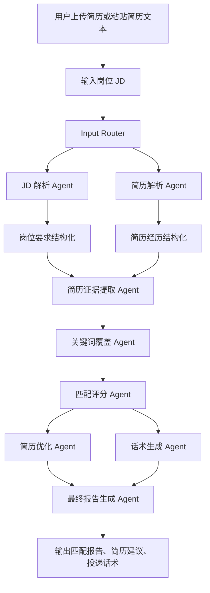
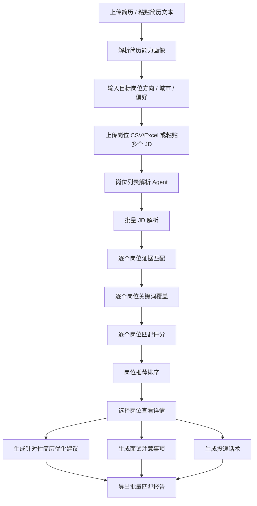
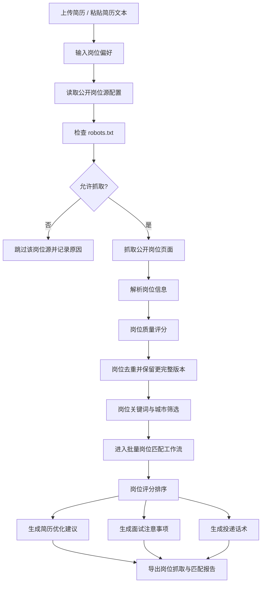
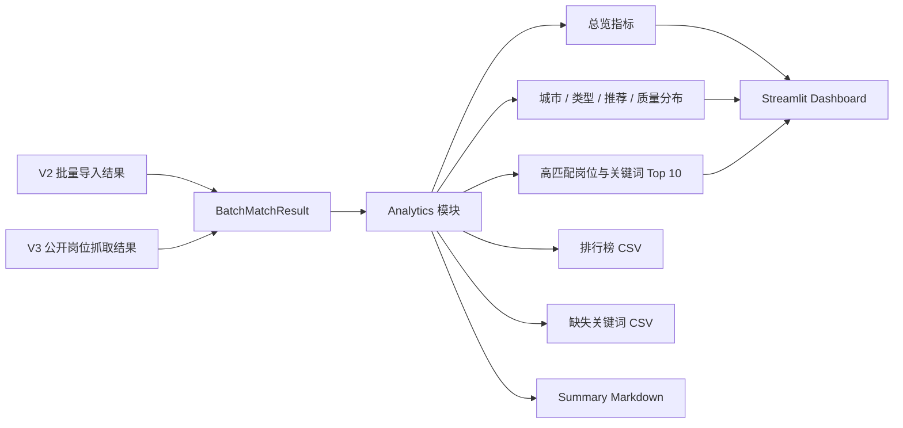

# Agent 工作流

本项目采用模块化 Agent 工作流。每个 Agent 负责一个清晰步骤，输入输出使用 Pydantic 模型承接。MVP 默认使用 mock/规则模式；当 `.env` 中配置 `OPENAI_API_KEY` 且 `LLM_MODE=openai` 或 `auto` 时，Agent 会通过 `src/llm_client.py` 调用 OpenAI API 做增强解析，并在失败时回退到本地规则结果。

## 工作流总览

| 步骤 | 模块 | 输入 | 处理逻辑 | 输出 |
| --- | --- | --- | --- | --- |
| 1 | Input Router | 上传文件、粘贴简历、JD、目标岗位方向 | 解析文件并合并文本，校验简历和 JD 非空 | 简历文本、JD 文本、岗位方向 |
| 2 | JD 解析 Agent | JD 文本、岗位方向 | 提取岗位名称、公司、地点、职责、硬技能、软技能、工具、业务关键词、学历经验和隐含能力 | `JDAnalysis` |
| 3 | 简历解析 Agent | 简历文本 | 提取教育、项目、实习、技能、成果指标、关键词和可迁移能力 | `ResumeAnalysis` |
| 4 | 简历证据提取 Agent | `JDAnalysis`、`ResumeAnalysis` | 将 JD 要求与简历项目/实习/技能映射，判断强/中/弱/缺失 | `List[EvidenceMatch]` |
| 5 | 关键词覆盖 Agent | `JDAnalysis`、`ResumeAnalysis` | 比较 JD 关键词与简历关键词，识别强覆盖、弱覆盖、未覆盖 | `KeywordCoverage` |
| 6 | 匹配评分 Agent | JD、简历、证据、关键词覆盖 | 按技能 30%、项目 25%、关键词 20%、职责 15%、教育 10% 计算分数 | `ScoreBreakdown` |
| 7 | 简历优化 Agent | JD、简历 | 对原始 bullet 做投递版改写建议，保持不编造原则 | `List[OptimizationSuggestion]` |
| 8 | 话术生成 Agent | JD、简历、评分、岗位方向 | 生成 Boss、邮件、LinkedIn、内推和面试介绍话术 | `OutreachMessages` |
| 9 | 最终报告 Agent | 全部中间结果 | 汇总为结构化 Markdown 报告 | `FinalReport` |
| 10 | 报告导出模块 | `WorkflowResult` | 将结构化结果写入 Word 文档 | `.docx` bytes |

## Agent 详细说明

### JD 解析 Agent

- 文件：`src/agents/jd_parser_agent.py`
- 输入：岗位 JD 文本、目标岗位方向。
- 处理逻辑：识别职责段落、技能关键词、工具栈、业务关键词、学历和经验要求；根据岗位方向推断隐含能力。
- 输出：岗位名称、公司、地点、职责、硬技能、软技能、工具栈、业务关键词、学历要求、经验要求、隐含能力。

### 简历解析 Agent

- 文件：`src/agents/resume_parser_agent.py`
- 输入：简历纯文本。
- 处理逻辑：按教育、项目、实习、技能等标题拆分；抽取量化指标和关键词；推断可迁移能力。
- 输出：教育背景、项目经历、实习经历、技能栈、成果指标、关键词、可迁移能力。

### 简历证据提取 Agent

- 文件：`src/agents/evidence_agent.py`
- 输入：JD 结构化结果、简历结构化结果。
- 处理逻辑：把 JD 技能、工具、业务关键词、职责和隐含能力逐项映射到简历句子；根据直接命中程度给出证据强度。
- 输出：岗位要求、简历证据、证据强度、建议补充表达。

### 关键词覆盖 Agent

- 文件：`src/agents/keyword_agent.py`
- 输入：JD 结构化结果、简历结构化结果。
- 处理逻辑：构建 JD 关键词集合，和简历关键词/全文比较；部分常见同义词归为弱覆盖。
- 输出：已覆盖关键词、弱覆盖关键词、未覆盖关键词、覆盖率和说明。

### 匹配评分 Agent

- 文件：`src/agents/scoring_agent.py`
- 输入：JD、简历、证据表、关键词覆盖。
- 处理逻辑：按固定权重计算总分，并输出每个维度原因。
- 输出：总分、分项得分、优势、风险和总结。

### 简历优化 Agent

- 文件：`src/agents/resume_optimizer_agent.py`
- 输入：JD、简历。
- 处理逻辑：选择简历中项目/实习 bullet，与 JD 关键词对齐，给出更适合投递的表达方向。
- 输出：修改前、修改后、理由、风险提示。

### 话术生成 Agent

- 文件：`src/agents/outreach_agent.py`
- 输入：JD、简历、评分、目标岗位方向。
- 处理逻辑：提取优势和岗位信息，生成不同渠道的短文本。
- 输出：Boss 直聘、邮件正文、LinkedIn 私信、内推请求、面试自我介绍。

### 最终报告 Agent

- 文件：`src/agents/report_agent.py`
- 输入：全部 Agent 输出。
- 处理逻辑：把结构化结果组织成 Markdown 报告。
- 输出：完整 Markdown 报告。

### 报告导出模块

- 文件：`src/report_exporter.py`
- 输入：`WorkflowResult`。
- 处理逻辑：使用 `python-docx` 生成 Word 报告，包含岗位摘要、JD 解析、证据表、关键词、评分、优化建议、投递话术和结论。
- 输出：可下载的 `.docx` 文件字节流。

## V2 批量岗位匹配工作流

V2 保留 V1 的所有 Agent 和 `src/workflow.py`，通过独立的 `src/batch_workflow.py` 编排批量流程。简历仅解析一次，每个岗位继续复用 V1 的 JD 解析、证据匹配、关键词覆盖、评分、简历优化和投递话术能力。

### V2 模块说明

| 模块 | 输入 | 处理逻辑 | 输出 |
| --- | --- | --- | --- |
| 岗位列表解析 Agent | CSV / Excel 字节或多 JD 文本 | 统一字段、拆分 `---JOB---`、补齐未知公司/城市/类型，跳过无 JD 的空行 | `List[JobPosting]` |
| 简历解析 Agent | 简历文本 | 复用 V1 解析器，批量任务中只执行一次 | `ResumeAnalysis` |
| 批量匹配 Agent | `ResumeAnalysis`、岗位列表、目标方向 | 对每个岗位复用 V1 的 JD、证据、关键词、评分、优化和话术 Agent，并生成面试准备 | `List[JobMatchResult]` |
| 面试准备 Agent | JD、简历、证据匹配、评分风险 | 生成问题、项目讲解、技术/业务准备、风险追问和诚实回答策略 | `InterviewPrep` |
| 批量工作流 | 简历、岗位列表、求职偏好 | 汇总结果，按总分降序排列，识别建议投递和低优先级岗位 | `BatchMatchResult` |
| 批量报告生成 | `BatchMatchResult` | 生成排行榜和逐岗位详情 | Markdown 报告 |

### 推荐分档

- 80 分及以上：强烈建议投递。
- 65-79 分：建议投递，可针对性优化简历。
- 50-64 分：谨慎投递，需要补强关键词或项目表达。
- 50 分以下：不优先投递。

### 数据来源边界

V2 支持用户上传最新岗位 CSV / Excel，或手动粘贴多个 JD。V3 在此基础上增加公开岗位源导入，默认提供常见招聘平台和公司官网 Careers 作为来源选项。系统不会因为平台名称一刀切拒绝，但只会在页面公开可访问且 robots.txt 允许时进行轻量抓取；如果页面需要登录、验证码或访问受限，会跳过并记录原因。

## V3 公开岗位源抓取工作流

V3 通过独立的 `src/job_sources/` 和 `src/crawl_workflow.py` 接入 V2。抓取层只负责合规检查、公开页面访问、岗位候选解析与筛选；后续评分、简历优化、面试准备和话术继续复用 V2。

### V3 模块说明

| 模块 | 输入 | 处理逻辑 | 输出 |
| --- | --- | --- | --- |
| Source Config | JSON 配置、默认来源选项、自定义公开 URL | 校验 source_type、public_only、URL 结构；不按域名黑名单禁用平台 | `List[JobSource]` |
| Robots Checker | 岗位列表 URL | 请求 robots.txt；拒绝或网络失败时安全跳过 | `robots_disallowed` 或允许状态 |
| Public Web Source | 公开静态 HTML 页面 | 判断 HTTP 状态、登录/验证码文本，补全相对链接，解析岗位链接/文本并写入一小时缓存 | `List[CrawledJob]` 或访问状态 |
| Job Crawler Agent | 来源列表、最大岗位数 | 对来源逐一检查、至少间隔 1 秒访问，单个来源失败不影响其他来源 | `List[CrawlResult]` |
| Job Quality Scorer | `List[CrawledJob]` | 按字段完整度、JD 长度、技能词和来源信息计算 0-100 分及 warning | 带质量字段的岗位列表 |
| Job Deduplicator | 带质量字段的岗位列表 | 按 URL 或公司+岗位+城市分组，保留更完整且 JD 更长的版本 | `JobDeduplicationResult` |
| Job Filter Agent | 抓取岗位、方向/城市/类型/关键词 | 优先保留偏好匹配岗位，过滤明显不相关内容 | `JobFilterResult` |
| Crawl Workflow | 简历、偏好、来源配置或 Demo 数据 | 将筛选岗位转换为 `JobPosting` 并调用 V2 | `CrawlWorkflowResult` |

### 合规与稳定性边界

- 系统默认提供 Boss 直聘、智联招聘、猎聘、前程无忧、拉勾、实习僧、牛客招聘、应届生求职网、LinkedIn Jobs、Indeed、Seek、GradConnection、公司官网 Careers 和自定义公开 URL 作为来源选项。
- 不因为平台名称一刀切拒绝；是否可抓取由 robots.txt、HTTP 状态、页面内容和解析结果决定。
- 仅处理无需登录且公开可访问的静态 HTML 页面；如需登录、验证码或 robots.txt 不允许则跳过。
- 不使用验证码绕过、模拟登录、Cookie 复用、代理池或浏览器指纹绕过。
- robots.txt 不允许、无法检查或返回异常状态时，默认跳过并显示原因。
- 页面请求设置超时、5 MB 响应上限、最大岗位数量、来源间隔和缓存。
- 每条结果保留 `source_url_status` 和 `source_url_note`；相对链接会被补全，无效链接会被标记而不是伪装成可点击链接。
- Demo 模式读取本地 JSON，不发起任何网络请求，岗位链接显示为“示例数据，无真实岗位链接”。

### V3 访问状态

| 状态 | 含义 | 页面处理 |
| --- | --- | --- |
| `public_accessible` | robots 允许，HTTP 正常，页面内容可解析 | 进入岗位解析 |
| `robots_disallowed` | robots.txt 不允许访问 | 跳过并显示 robots 原因 |
| `login_required` | HTTP 401/403 或页面包含登录提示 | 跳过，建议导入或粘贴 JD |
| `captcha_or_blocked` | HTTP 429 或页面包含验证码/安全检查提示 | 跳过，禁止绕过 |
| `http_error` | 其他 HTTP 错误或响应过大 | 跳过 |
| `parse_failed` | 页面公开但内容过短或未解析到岗位 | 显示解析失败原因 |
| `no_public_url` | 默认来源未配置明确公开 URL | 提示用户粘贴具体公开 URL |
| `demo_data` | 本地示例数据 | 不渲染真实岗位链接 |

### V3.1 质量与去重说明

1. 原始岗位先计算质量分，不会因为低分被直接删除。
2. 去重优先使用规范化后的 `source_url`；链接缺失时使用 `company + job_title + city`。
3. 重复组保留字段更完整、JD 更长的版本，并在保留记录上写入 `duplicate_group` 和 `is_duplicate`。
4. 质量分由岗位名称、公司、城市、JD 长度、技能关键词、来源链接和发布日期组成。
5. 质量标签分为高、中、低；低质量记录在页面标记为“低置信度”。
6. 工作流统计原始数量、去重后数量、筛选后数量、三档质量数量、robots 跳过来源和抓取失败来源。

## V3.2 岗位分析 Dashboard

V3.2 在 V2/V3 得到 `BatchMatchResult` 后增加只读 Analytics 层。该层不修改 Agent 输出、匹配分或推荐结论，只负责聚合分析和导出。

### Analytics 输入输出

| 输入 | 处理 | 输出 |
| --- | --- | --- |
| `BatchMatchResult` 或 `List[JobMatchResult]` | 汇总匹配分、推荐档位和质量标签 | 总览指标 |
| 岗位城市、类型、推荐结论、质量标签 | 多值拆分与频次统计 | 四类分布字典 |
| 缺失关键词、JD 技能/工具、风险项 | 岗位内去重后计数 | Top 10 表格 |
| 完整岗位匹配列表 | 按匹配分排序并结构化 | 排行榜 CSV 与 Markdown 摘要 |

Dashboard 使用 Streamlit 原生 `metric`、`bar_chart` 和 `dataframe`，没有新增复杂可视化依赖。V2 未进行抓取质量评分的岗位显示为“未评分”，不会被误判为低质量。
